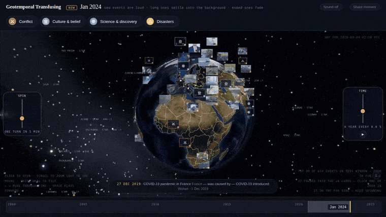
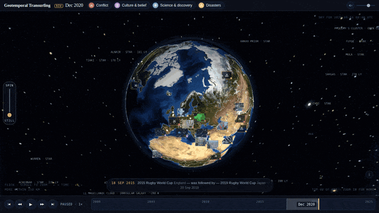

# Geotemporal Transurfing

Spin the Earth, slide to a month, click an event: a photograph, a headline, and what else was happening in the world at that moment.



**[Try it](#)** · 71,507 events, 2000–2025 · three.js, no build step · MIT

Every event stands on the globe where it happened, on a beam straight up from its own coordinates; two events in one place are two holograms at two heights. Time is a film: it rolls from the moment the page opens, and the transport at the bottom rewinds, pauses and fast-forwards it — a step faster each press, either way. Events fade as they age, in proportion to how big they were. Where a place is too crowded to draw them all, the top card wears a **+N** chip and lists the rest.



The sky behind the Earth is the real sky for the moment shown — Yale Bright Star Catalog, the Moon at its true phase and distance.

```bash
npm run dev          # serve site/ at localhost:8000
npm run build        # rebuild site/data from pipeline output (seconds)
npm run refresh      # full data refresh (hours, needs network, caches everything)
```

A fresh clone runs as-is: `site/data`, `site/img` and `site/media` are committed. Deploy is Cloudflare Pages with no build command and output directory `site`.

## Data

Events and dates from **Wikidata**, descriptions from **Wikipedia** (CC BY-SA), photographs and clips from **Wikimedia Commons** under the licence shown in each panel. Earth is NASA Blue Marble, borders are Natural Earth. A GitHub Action refreshes it weekly.

## Known gaps

- Coverage leans European and recent; the year-by-country pages even it out from 2000 on.
- "Simultaneous" means same calendar day. Wikidata has no time of day.
- Headlines are written by rules, so the odd one still reads like an article title.
- Desktop only. A phone-sized viewport works but is not designed for.

## Contributing

Three files, no framework: `site/index.html`, `site/app.js`, `site/styles.css`. Adding an event needs no code — see [CONTRIBUTING.md](CONTRIBUTING.md). How the pipeline and the data model work: [docs/internals.md](docs/internals.md).

Code is MIT. Data and media keep their own terms; see [LICENSE](LICENSE).
