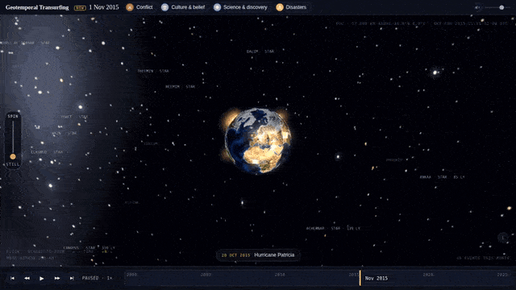
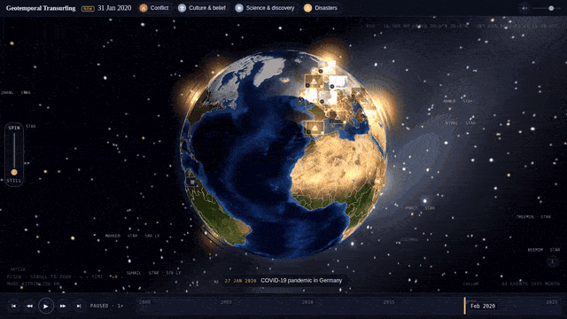
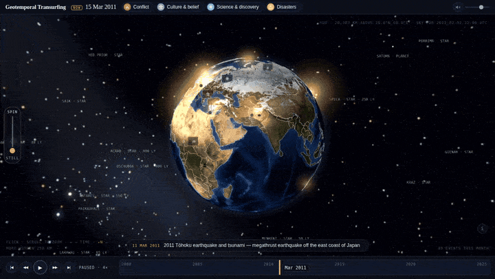

# Geotemporal Transurfing

Roll the Earth, slide time, pick a moment. Every event stands where it happened; the line under the globe says what else happened that same day on the other side of the world.

**[Try it](https://geotemporal-transurfing.pages.dev)** · 72,000 events, 2000–2025 · three.js, no build step · MIT


*Zoom out until the Moon is in frame, in until a country fills it — more events appear the closer you come.*



*Time runs like a film: play, pause, 2× to 16×, forward or back. Cards rise as their day approaches and sink as it passes.*



*Click a line under the globe and you fly there: the globe turns, the camera comes down, the panel opens with what else happened that day.*



```bash
npm run dev          # serve site/ at localhost:8000 — a fresh clone runs as-is
npm run build        # rebuild site/data from the pipeline's output (seconds)
npm run refresh      # pull everything again from Wikidata, Wikipedia and Commons (hours)
```

Events and dates come from Wikidata, descriptions from Wikipedia (CC BY-SA), photographs and clips from Wikimedia Commons under the licence shown in each panel; the Earth is NASA's Blue Marble and the sky is the real sky for the moment shown. How it fits together: [docs/internals.md](docs/internals.md). To add an event, fix a headline or add a source: [CONTRIBUTING.md](CONTRIBUTING.md).

**What this is.** A proof of concept, nothing more: an idea about what it would feel like to be unbound by space and time and look at the Earth's recent past all at once. It was prototyped quickly with Claude (Anthropic's model) doing most of the coding from spoken direction, over a few days, so expect rough edges — headlines written by rules, uneven coverage between countries, a desktop-only layout. The design decisions worth keeping are written down in [docs/internals.md](docs/internals.md); everything else is up for grabs.

Code is MIT; data and media keep their own terms ([LICENSE](LICENSE)).
