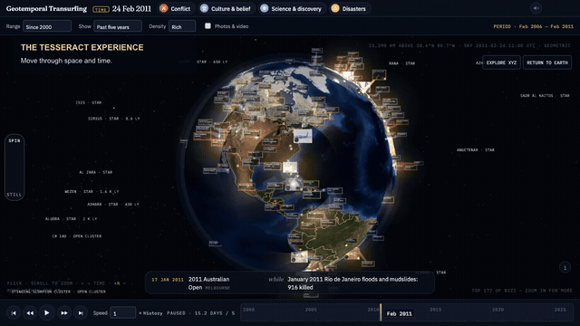
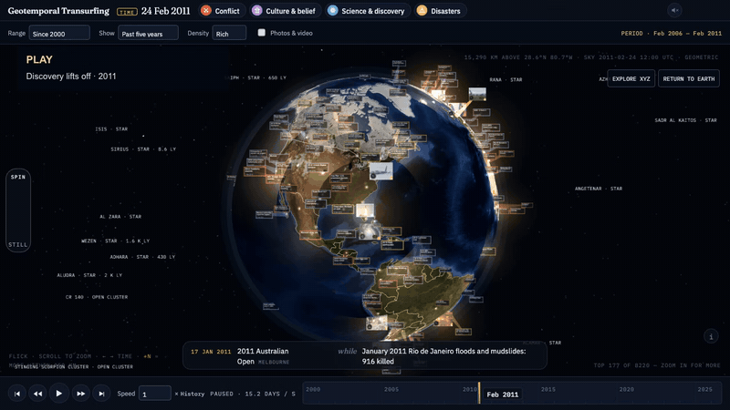
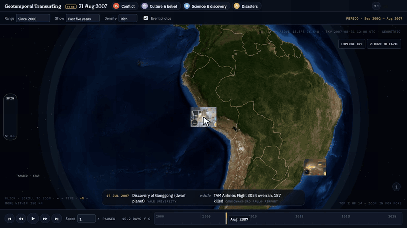
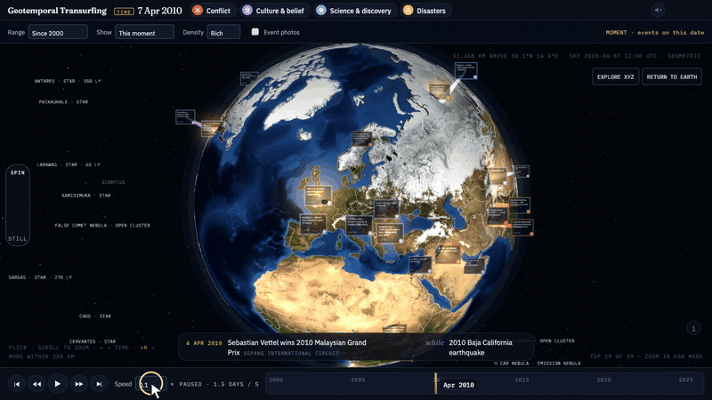

# Geotemporal Transurfing

The Tesseract experience lets you explore geotemporal time: orbit and zoom through space, pause, reverse, or rewind time and event footage, accelerate through history, and see what was happening elsewhere concurrently.

**[Try it](https://geotemporal-transurfing.pages.dev/)**




**Pause. Reverse. Accelerate.** Watch Discovery lift off, freeze the footage, then rewind into earlier history. The app supports speeds up to 60×; this walkthrough shows 16×.



**Follow an event across the world.** Read its photographs and context, then choose “Meanwhile, elsewhere” to fly to another location.



**Control time and space.** Slow down, speed up, reverse, and pause. Switch to independent XYZ movement, look around, and return to Earth.



The opening projects archival wedding footage among the event cards. The reverse sequence uses NASA’s archival Discovery launch footage. The navigation and XYZ walkthroughs use verified archival photographs. Period views show their date range; Moment view shows events on the selected date. [Recording and media credits](docs/demo-media-credits.md).

## How it works

Events are collected offline from Wikipedia, Wikidata, and curated records, then placed on the globe by date and location. Earth uses static NASA imagery wrapped around a 3D globe, with a [sky calculated from a star catalog and astronomical models](docs/observer-and-sky-validation.md); it is not a live satellite feed. Dated photos and clips share the time controls, while “Meanwhile” takes you to events in other places.

## Run locally

```bash
npm run dev          # serve the existing site at localhost:8000
npm run build        # rebuild event data from existing pipeline outputs
npm run refresh      # fetch updated source data and media
npm test             # clock, event, loading, and observer checks
```

Local serving uses Python 3. [Technical details and data format](docs/internals.md).

Data and media retain their original licenses.

I’d appreciate feedback and ideas.
